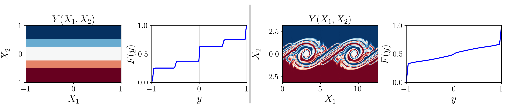

NumDF
*****

NumDF is a finite element based method for constructing the probability density of a field (e.g. temperature as a function of space) 
specified as function, either analytically or by direct numerical simulation. By making explicit use of the functional form of the expression 
or simulation field provided, NumDF is a powerful way to better exploit the information provided by a pseudo-spectral method, finite-element 
or high-order spectral method. Initially motivated by the need to calculate the probability density of the buoyancy field in order to estimate 
the available potential energy (ape) of a body of fluid (Lorenz, E.N. 1955), we envisage NumDF as a useful tool to provide an accurate an 
robust estimation of this quantity.

NumDF is written in python and makes extensive use of the finite element method solver `Firedrake <https://www.Firedrakeproject.org>`_. 

NumDF documentation
===================

.. toctree::
   :maxdepth: 2
   :caption: Contents:

   installation
   methodology
   tutorials
   numdf

Links
=====
* Code repository: https://github.com/mannixp/D.stratify-pdfe
* Documentation: 

Developers
==========
* `Paul Mannix <https://profiles.imperial.ac.uk/p.mannix15>`_
* `David Ham <https://profiles.imperial.ac.uk/david.ham>`_
* `John Craske <https://profiles.imperial.ac.uk/john.craske07>`_